# Adversary Emulation and Detection Lab Report

## Student Information

| Field | Value |
|---|---|
| Name | Faysal Mahamud |
| ID/Roll | 60050 |
| Course | CSE 802 Information Security and Cryptography Lab |
| Topic | Adversary Emulation and Detection Lab |

## 1. Objective

The objective of this lab was to build a small SOC monitoring environment,
generate Windows attack telemetry with Atomic Red Team, forward the logs to
Splunk Enterprise, and detect the activity using Sysmon event data. The lab
focused on five MITRE ATT&CK techniques: Scheduled Task, MSHTA, LSASS dumping,
PowerShell execution, and registry modification.

## 2. Lab Architecture

The lab used two NAT-connected virtual machines. Kali Linux hosted Splunk
Enterprise as the SIEM server, while Windows Server 2019 acted as the target
system where Sysmon, Splunk Universal Forwarder, and Atomic Red Team were
installed.

| Role | Hostname | IP address | CPU | RAM | Disk | Network |
|---|---|---|---:|---:|---:|---|
| Splunk/SIEM Server | `kali` | `192.168.150.132` | 4 cores | 8 GB | 100 GB | NAT |
| Windows Target | `WIN-NRK6CVIIP4J` | `192.168.150.133` | 4 cores | 8 GB | 80 GB | NAT |

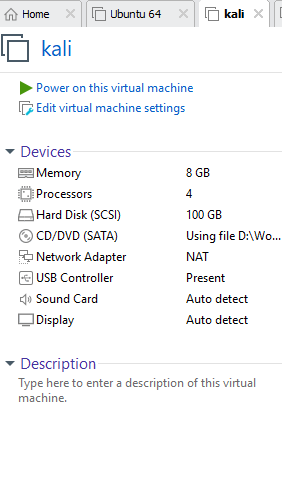

**Figure 1:** Kali VM configuration.


**Figure 2:** Windows Server 2019 VM configuration.

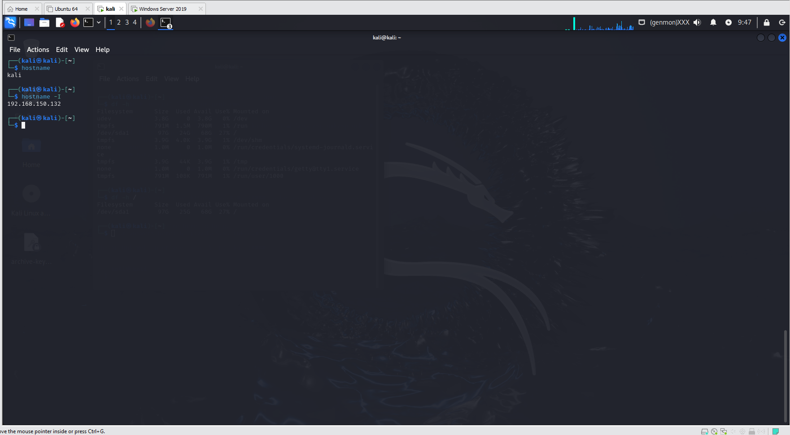

**Figure 3:** Kali hostname and IP address.

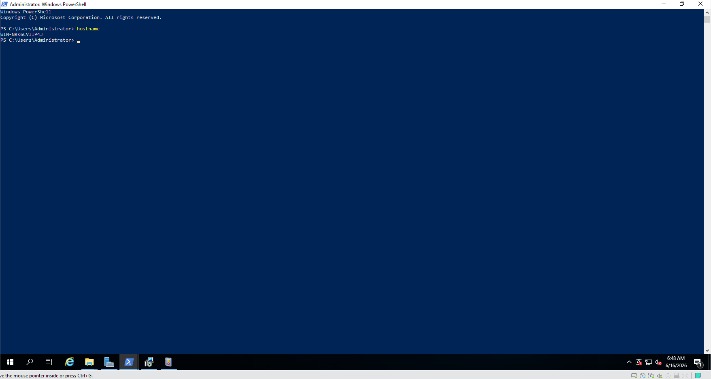

**Figure 4:** Windows Server hostname.

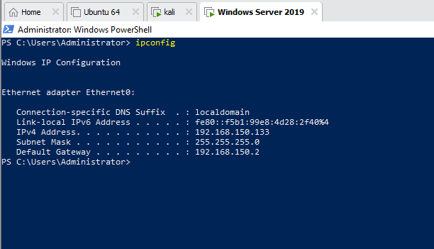

**Figure 5:** Windows Server IP address.

## 3. Splunk Enterprise Setup

Splunk Enterprise was installed on Kali Linux and accessed through
`http://kali:8000`. The Splunk server was configured to receive forwarded data
on TCP port `9997`.

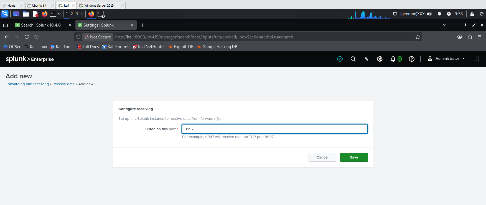

**Figure 6:** Splunk receiving port configuration.

## 4. Sysmon and Universal Forwarder Setup

Sysmon was installed on the Windows Server to collect detailed endpoint
telemetry. Splunk Universal Forwarder was installed on the same Windows Server
and configured to send Windows/Sysmon event logs to the Splunk server at
`192.168.150.132:9997`.

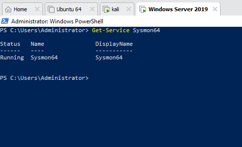

**Figure 7:** Sysmon service running on Windows Server.

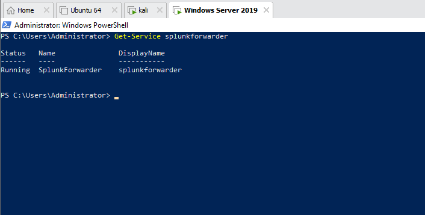

**Figure 8:** Splunk Universal Forwarder service running.

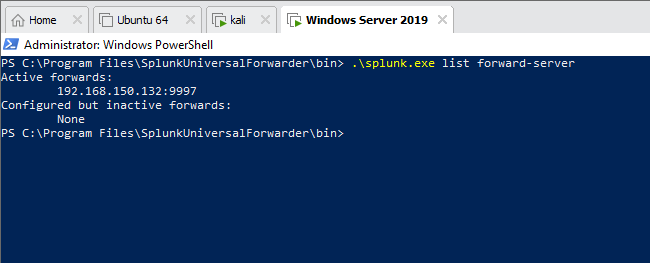

**Figure 9:** Forwarder connected to the Splunk server.

The log pipeline was verified in Splunk using the Windows host value
`WIN-NRK6CVIIP4J`.


**Figure 10:** Windows logs received in Splunk.

Sysmon Operational logs were also verified in Splunk.

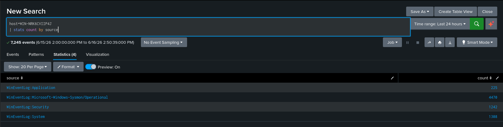

**Figure 11:** Sysmon Operational source visible in Splunk.


**Figure 12:** Sysmon Event ID distribution.

## 5. General Sysmon Detection Views

The following screenshots show that Splunk can display Sysmon process creation,
file creation, and registry modification events from the Windows target.


**Figure 13:** Sysmon process creation events.


**Figure 14:** Sysmon file creation events.


**Figure 15:** Sysmon registry modification events.

## 6. Attack Emulation and Detection

### 6.1 T1053.005 - Scheduled Task

**Tactic:** Persistence

Atomic Red Team was used to list available scheduled task tests for
`T1053.005`. The lab evidence focuses on scheduled task activity captured in
Sysmon registry events.


**Figure 16:** Atomic Red Team scheduled task test list.


**Figure 17:** Sysmon registry evidence for scheduled task activity.

**Detection approach:** Sysmon Event ID `13` was useful because scheduled task
creation and modification can produce registry changes under the Windows Task
Cache path. In Splunk, the evidence showed task-related registry objects and the
time of modification.

### 6.2 T1218.005 - MSHTA

**Tactic:** Defense Evasion

MSHTA was executed through Atomic Red Team using the remote HTA execution test.
The test launched calculator as visible proof of execution.

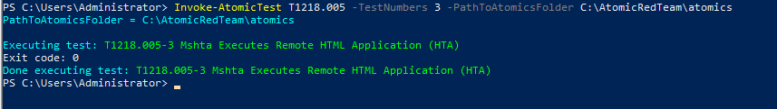

**Figure 18:** Atomic Red Team MSHTA execution.

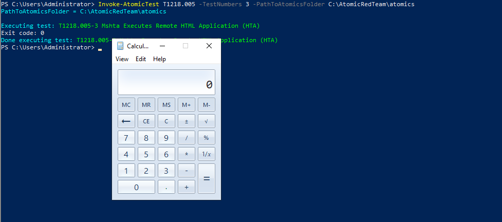

**Figure 19:** Calculator launched after MSHTA execution.

The Splunk search focused on `mshta.exe` in Sysmon Operational logs.

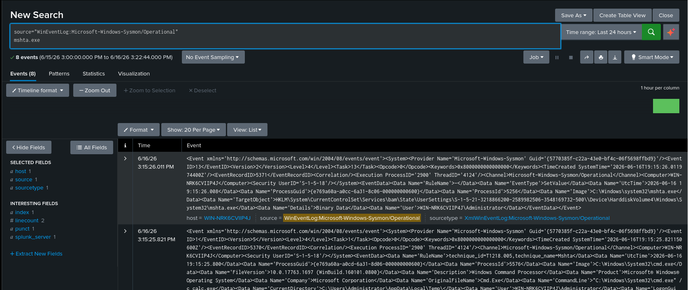

**Figure 20:** MSHTA activity detected in Splunk.

**Detection approach:** Sysmon Event ID `1` was the most helpful event because
it records process creation and command-line details. The detection used the
presence of `mshta.exe` and its execution context.

### 6.3 T1003.001 - LSASS Dumping

**Tactic:** Credential Access

Atomic Red Team was used to run the LSASS dumping test with `rdrleakdiag.exe`.
The endpoint protection blocked the malicious content during execution, but the
attempt was still captured in Sysmon and Splunk.

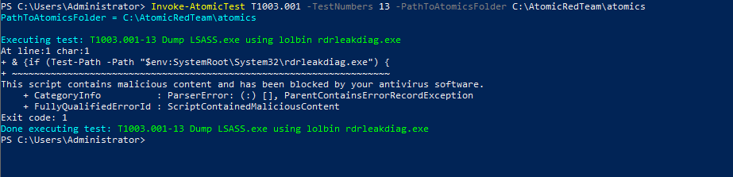

**Figure 21:** Atomic Red Team LSASS dump attempt.

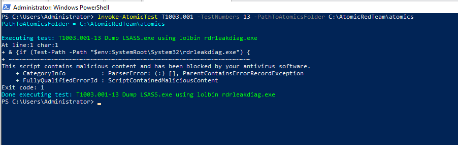

**Figure 22:** LSASS dump attempt blocked by endpoint protection.

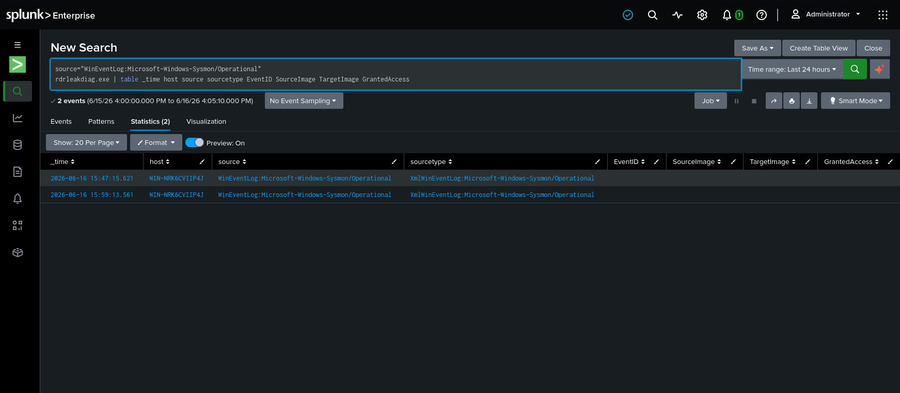

**Figure 23:** `rdrleakdiag.exe` evidence in Splunk.

**Detection approach:** The lab identified the LSASS dumping attempt by
searching Sysmon Operational logs for `rdrleakdiag.exe`, the living-off-the-land
binary used by the Atomic Red Team test. Event ID `1` provided useful evidence
of attempted execution. Event ID `10` is normally the strongest signal for LSASS
process access, but in this run the attempt was blocked before a clean process
access record with parsed `TargetImage=lsass.exe` was available.

### 6.4 T1059.001 - PowerShell

**Tactic:** Execution

Atomic Red Team was used to execute a PowerShell command test. The output was
captured in the Windows PowerShell console and then searched in Splunk.

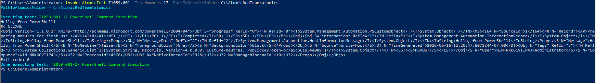

**Figure 24:** Atomic Red Team PowerShell execution.

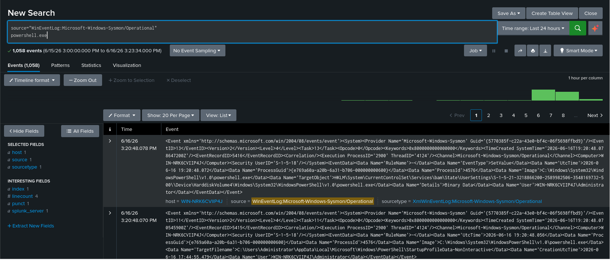

**Figure 25:** PowerShell activity visible in the console.

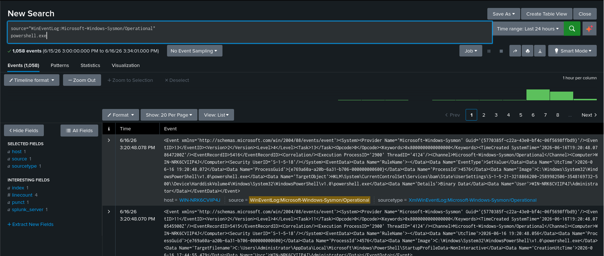

**Figure 26:** PowerShell activity detected in Sysmon logs.

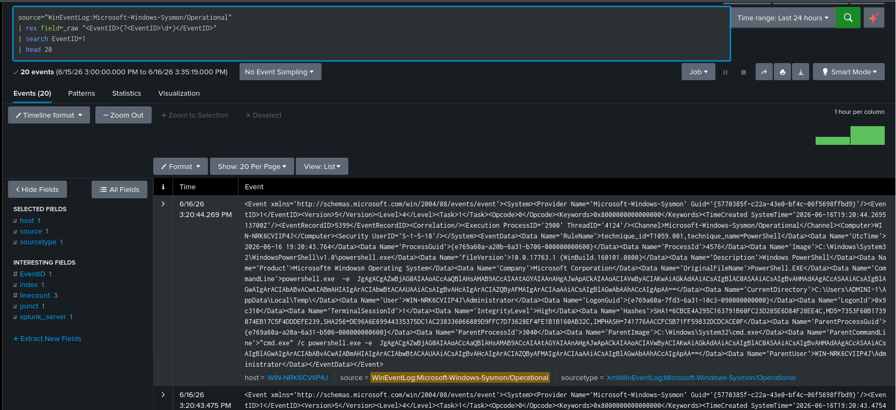

**Figure 27:** Sysmon Event ID 1 evidence for PowerShell execution.

**Detection approach:** Sysmon Event ID `1` was the most useful event because it
captures PowerShell process creation and command-line content. The detection
focused on `powershell.exe` activity from the Windows target.

### 6.5 T1112 - Registry Modification

**Tactic:** Defense Evasion

Atomic Red Team was used to run a registry modification test. The test modified
registry values from PowerShell, and Splunk captured the registry events from
Sysmon Operational logs.

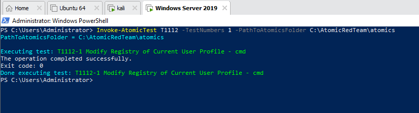

**Figure 28:** Atomic Red Team registry modification execution.

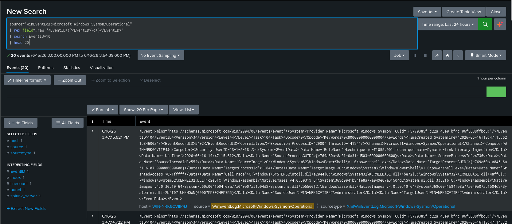

**Figure 29:** Registry modification evidence in Splunk.

**Detection approach:** Sysmon Event ID `13` was the most useful event because
it records registry value changes. The evidence showed registry activity
associated with the Windows target and PowerShell execution.

## 7. Useful SPL Queries

### Sysmon Source Count

```spl
host=WIN-NRK6CVIIP4J
| stats count by source
```

### Sysmon Event ID Distribution

```spl
source="WinEventLog:Microsoft-Windows-Sysmon/Operational"
| rex field=_raw "<EventID>(?<EventID>\d+)</EventID>"
| stats count by EventID
```

### Process Creation

```spl
source="WinEventLog:Microsoft-Windows-Sysmon/Operational"
| rex field=_raw "<EventID>(?<EventID>\d+)</EventID>"
| rex field=_raw "<Data Name='Image'>(?<Image>[^<]+)</Data>"
| rex field=_raw "<Data Name='CommandLine'>(?<CommandLine>[^<]+)</Data>"
| table _time EventID Image CommandLine
```

### MSHTA Detection

```spl
source="WinEventLog:Microsoft-Windows-Sysmon/Operational"
mshta.exe
```

### PowerShell Detection

```spl
source="WinEventLog:Microsoft-Windows-Sysmon/Operational"
powershell.exe
```

### LSASS Dump Attempt

```spl
source="WinEventLog:Microsoft-Windows-Sysmon/Operational"
rdrleakdiag.exe
| table _time host source sourcetype EventID SourceImage TargetImage GrantedAccess
```

### Registry Modification

```spl
source="WinEventLog:Microsoft-Windows-Sysmon/Operational"
| rex field=_raw "<EventID>(?<EventID>\d+)</EventID>"
| search EventID=13
| head 20
```

## 8. Challenges

The main challenge was reliable Sysmon field extraction in Splunk. Some fields
such as `SourceImage`, `TargetImage`, and `GrantedAccess` were not always
extracted into separate Splunk fields. For this reason, several searches used
the raw Sysmon XML and `rex` field extraction. Another challenge was the LSASS
dumping test, which was blocked by endpoint protection. The blocked attempt was
still useful because the execution attempt was visible in Sysmon/Splunk.

## 9. Conclusion

This lab successfully created a two-machine monitoring environment using Kali,
Splunk Enterprise, Windows Server 2019, Sysmon, Splunk Universal Forwarder, and
Atomic Red Team. Windows telemetry was forwarded to Splunk, Sysmon Operational
logs were verified, and the required MITRE ATT&CK techniques were investigated
with Splunk searches. The exercise demonstrated how endpoint telemetry can be
used to identify process creation, registry changes, file activity, MSHTA
execution, PowerShell activity, and an LSASS dumping attempt.
